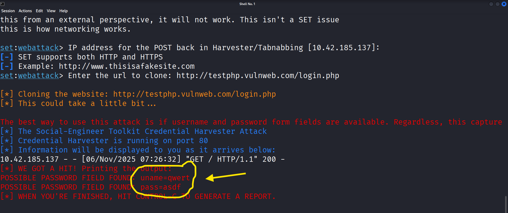

# Social-Engineering-Tactics

## Executive Summary
This document documents a controlled lab exercise demonstrating a basic phishing campaign using common social engineering tools. The objective was to show how attackers can profile a target, create a convincing phishing page and link, deliver the link by email, and capture credentials. This exercise was performed in a controlled environment on a Kali Linux machine targeting a lab Android device. The purpose is educational: to understand attack flow and strengthen defensive controls and user awareness.

## Scope, Objectives & Rules of Engagement

### Scope
- **Attacker machine**: Kali Linux (lab VM)
- **Target**: lab Android OS device (owned/controlled by the test team)
- **Network**: isolated lab network (no production systems, no third-party victims)

### Objectives
- Demonstrate reconnaissance techniques to identify publicly available target information.
- Build phishing resources (fake landing page / hosted link).
- Deliver the phish via email and observe user interaction.
- Capture and log credentials to illustrate impact.
- Produce recommendations to reduce risk.
### Ethics & Legal
- All activity was conducted within a controlled lab on systems owned by the test team.
- No real user accounts, corporate systems, or third-party services were targeted.
- #This report is written for defensive training and to inform mitigation planning.

### Lab Setup
- **Machine OS**: Kali Linux
- **Target**: lab Android OS
- **Tools Used**: Setoolkit, zphisher, Google Dorking

  ---

### Reconnaissance
- During the recoconnesance,i gathered my infomationLab Setup & Tools

- Attacker OS: Kali Linux (VM)

- Target OS: Android (lab device/emulator)

- Tools used (examples):

- Google Dorking (manual web reconnaissance)

- Social-Engineer Toolkit (SET) — used to generate a phishing page template in a controlled environment

- Zphisher — used to produce a hosted link / landing page for testing

- Mail client (lab) — to send the phishing email

- Network controls: isolated VLAN or host-only network; no outbound traffic beyond lab infrastructure.  


### Methodology (High-Level)

- Reconnaissance — Gather publicly available information about the target using search operators and open sources to craft believable messaging.

- Resource Development — Create a convincing landing page and generate a link that resolves to the phishing page (host in the lab).

- Delivery — Send the phishing link via email from a lab account to the target device.

- Exploitation — When the target opened the link, the fake page collected credentials (captured to a controlled log).

- Analysis & Reporting — Record the attack timeline, artifacts, and lessons learned.


# Reconnaissance (Detailed)

- Goal: Collect information that makes the phishing message and landing page believable.

- Techniques used

- Google dorking / targeted search operators to find:

- Publicly exposed email addresses, usernames, or profile pages.

- References to the target’s organization or apps they use (to make the phishing context realistic).

- Public metadata from social profiles or developer pages to select appropriate branding/phrasing for the phishing page.

- Example search approaches (conceptual)

- Search for publicly available contact info or role descriptions to tailor email subject lines.

- Look for references to commonly used services/apps to craft plausible pretexts.

## Notes

- Only public information was used; no scanning or exploitation of external systems was performed.

- Recon results were documented (screenshots, query strings) and saved in the lab artifacts folder for audit.


### Resource Development

- Goal: Build a realistic phishing landing page and generate a working test link within the lab environment.

## What was prepared

- A hosted landing page containing a login form styled after a legitimate service (for lab demonstration only).

- Tooling used to quickly scaffold the page included SET and zphisher (configured to host pages on the lab server).

- Logging mechanism to capture HTTP POST data into a controlled file for analysis.


# Delivery

- Goal: Deliver the phishing link and observe user interaction.

  ### Delivery channel

- Email sent from a lab account to the lab Android device.

### message characteristics

- Subject line and body tailored using reconnaissance findings to increase plausibility (e.g., referencing a recent lab “update” or “account verification”).

- Email headers and visible sender were controlled (lab account). No spoofing of third-party real domains was performed.

- Example email (sanitized)

```bash
- Subject: Action Required: Verify Your Lab Account
- From: Digitqalworld@gmail.com

- Body: Hello — we noticed an issue with your lab account. Please verify by visiting the link below: [HTTP://TESTPHP.VULNWEB.COM]
```

## Observation


The target device loaded the page and submitted credentials (see Exploitation).


# Exploitation / Data Capture

### What happened

- When the target clicked the link and submitted the form, credential data (username + password) was posted to the lab server .

### Impact

- Demonstrated how a single successful phishing event can disclose account credentials, enabling potential unauthorized access if reused elsewhere.

- Handling of sensitive data

- All captured credentials in this report are redacted.


- Lab credentials were reset/invalidated after the test.


# Findings & Analysis

## Success factors

- Plausible pretext informed by reconnaissance increased likelihood of click.

- Simple, familiar login UI reduced suspicion.

- Lack of multi-factor authentication allowed immediate credential use.

### Detection opportunities

- Email filtering/ML-based detection could flag suspicious messages with short URLs, unusual sender patterns, or mismatched message content.

- Web proxy logs and IDS can detect and block connections to known phishing pages.


#  Recommendations — Mitigation & Security Awareness

-  Below are prioritized, practical steps to reduce the likelihood and impact of phishing campaigns.

### Technical Controls

- Enable Multi-Factor Authentication (MFA) on all accounts — prevents credential reuse from enabling access.

- Email authentication: Implement SPF, DKIM, and DMARC to reduce successful spoofing of organization domains.

- Secure email gateway / filtering: Use ML/heuristic spam filters that inspect links and attachments.

- URL real-time scanning: Proxy or gateway that checks links at click time (and rewrites/blocks known malicious links).

- Browser protections & safe browsing: Ensure endpoints have updated browsers with safe-browsing features enabled.

- Network controls: Block known phishing hosts and apply web proxy filtering for suspicious content.

- Logging & alerting: Log webform POSTs and unusual authentication attempts; alert on new credential use from unfamiliar IPs.

### Organizational & Awareness Controls

- Continuous phishing awareness training — simulated phishing exercises plus reinforcement training for users who click.

- Phishing reporting mechanism — a simple “report phishing” button in email clients with an easy review workflow.

- Pretext awareness — teach users to verify unexpected requests that ask for credentials, especially those that create urgency.

- Least privilege & password hygiene — reduce reused passwords, enforce password managers, and encourage unique passwords.

- Incident response plan — a documented process for suspected phishing, including immediate password reset and account review.

### Practical user advice (what to teach users)

- Never enter credentials into a page reached from an unexpected link; instead navigate to the service manually.

- Hover over links to inspect actual destinations (or long-press on mobile to view link target) before clicking.

- Be suspicious of messages that ask for immediate action or confidential information.

- Use password managers (automatically fill only on the real domain).


#  Conclusion

- This lab illustrated how simple reconnaissance plus a plausible phishing pretext can lead to credential disclosure in the absence of layered defenses and good user - - - - awareness. The greatest risk reduction comes from combining technical controls (MFA, email authentication, gateway scanning) with ongoing user education and rapid - - - - - incident response.
